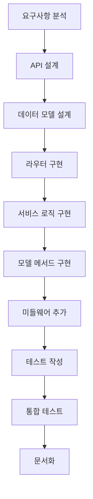

# AI 타이핑 튜터 백엔드 설계 사고 방식 및 개발 절차

## 📋 목차

1. [설계 철학](#설계-철학)
2. [아키텍처 설계 원칙](#아키텍처-설계-원칙)
3. [설계 패턴과 구조](#설계-패턴과-구조)
4. [개발 방법론](#개발-방법론)
5. [설계 결정 과정](#설계-결정-과정)
6. [확장성 고려사항](#확장성-고려사항)
7. [보안 설계 원칙](#보안-설계-원칙)
8. [성능 최적화 전략](#성능-최적화-전략)
9. [개발 절차와 워크플로우](#개발-절차와-워크플로우)
10. [코드 품질 관리](#코드-품질-관리)

---

## 🎯 설계 철학

### 핵심 가치

- **사용자 중심 설계**: 모든 API와 기능은 사용자 경험을 최우선으로 고려
- **확장 가능성**: 미래의 기능 확장을 염두에 둔 유연한 구조
- **신뢰성**: 안정적이고 예측 가능한 시스템 동작
- **유지보수성**: 명확하고 이해하기 쉬운 코드 구조
- **성능 효율성**: 최적화된 데이터 처리와 응답 속도

### 설계 목표

1. **모듈화**: 각 기능을 독립적인 모듈로 분리하여 재사용성과 테스트 용이성 확보
2. **일관성**: 전체 시스템에서 일관된 API 구조와 에러 처리 방식 적용
3. **확장성**: 사용자 증가와 기능 추가에 대응할 수 있는 아키텍처
4. **보안**: 다층 보안 체계를 통한 안전한 시스템 구축

---

## 🏗️ 아키텍처 설계 원칙

### 1. 계층형 아키텍처 (Layered Architecture)

```
┌─────────────────────────────────────┐
│           표현 계층 (Routes)         │
├─────────────────────────────────────┤
│           비즈니스 로직 계층           │
│        (Services/Controllers)       │
├─────────────────────────────────────┤
│            데이터 접근 계층           │
│          (Models/Database)          │
└─────────────────────────────────────┘
```

**적용 이유:**

- 관심사의 분리를 통한 코드 구조화
- 각 계층의 독립적인 테스트 가능
- 변경 사항의 영향 범위 최소화

### 2. MVC 패턴 (Model-View-Controller)

- **Model**: MongoDB 스키마를 통한 데이터 구조 정의
- **View**: RESTful API JSON 응답
- **Controller**: 라우터를 통한 요청 처리 로직

### 3. 의존성 주입 (Dependency Injection)

```javascript
// 예시: AIService 주입
const aiService = require("../services/aiService");

// 모듈화된 서비스 사용
const result = await aiService.generateTypingText(options);
```

---

## 🔧 설계 패턴과 구조

### 1. 싱글톤 패턴 (Singleton Pattern)

**적용 예시**: AI 서비스

```javascript
class AIService {
  constructor() {
    this.openai = new OpenAI({ apiKey: process.env.OPENAI_API_KEY });
  }
}

module.exports = new AIService();
```

**선택 이유:**

- OpenAI API 인스턴스의 중복 생성 방지
- 메모리 효율성 향상
- 전역 상태 관리

### 2. 팩토리 패턴 (Factory Pattern)

**적용 예시**: 타이핑 텍스트 생성

```javascript
// AI 텍스트 생성 팩토리
async generateTypingText(options) {
  const { difficulty, category, length, userLevel } = options;

  // 옵션에 따른 맞춤형 텍스트 생성
  return await this.createTextBasedOnOptions(options);
}
```

### 3. 미들웨어 패턴 (Middleware Pattern)

**적용 예시**: 인증 및 검증

```javascript
// 순차적 미들웨어 적용
app.use(helmet()); // 보안 헤더
app.use(rateLimit); // 요청 제한
app.use(authenticate); // 인증 확인
app.use(validateInput); // 입력값 검증
```

### 4. 옵저버 패턴 (Observer Pattern)

**적용 예시**: 사용자 통계 업데이트

```javascript
// Mongoose 미들웨어를 통한 자동 업데이트
userSchema.methods.updateStatistics = function (testResult) {
  // 테스트 완료 시 자동으로 통계 업데이트
  this.statistics.totalTests += 1;
  this.updateStreak();
};
```

---

## 📊 개발 방법론

### 1. 도메인 주도 설계 (Domain-Driven Design)

**도메인 모델링:**

- **User Domain**: 사용자 관리, 인증, 프로필
- **Typing Domain**: 타이핑 테스트, 결과 분석
- **AI Domain**: 텍스트 생성, 성능 분석
- **Analytics Domain**: 통계, 학습 패턴 분석

**바운디드 컨텍스트:**

```
┌─────────────┐  ┌─────────────┐  ┌─────────────┐
│ User Context│  │Typing Context│  │ AI Context  │
│             │  │             │  │             │
│ - Auth      │  │ - Tests     │  │ - TextGen   │
│ - Profile   │  │ - Results   │  │ - Analysis  │
│ - Stats     │  │ - Feedback  │  │ - Insights  │
└─────────────┘  └─────────────┘  └─────────────┘
```

### 2. API 우선 설계 (API-First Design)

**설계 순서:**

1. **API 명세 정의**: RESTful 엔드포인트 구조 설계
2. **데이터 모델 설계**: MongoDB 스키마 정의
3. **비즈니스 로직 구현**: 서비스 계층 개발
4. **통합 테스트**: 전체 플로우 검증

### 3. 테스트 주도 개발 (TDD) 접근

```javascript
// 예시: 사용자 통계 업데이트 테스트
describe("User Statistics Update", () => {
  it("should update total tests when test is completed", async () => {
    const user = await User.create(testUserData);
    const testResult = { wpm: 45, accuracy: 92, timeElapsed: 120 };

    user.updateStatistics(testResult);

    expect(user.statistics.totalTests).toBe(1);
    expect(user.statistics.totalTimeSpent).toBe(120);
  });
});
```

---

## 🛠️ 설계 결정 과정

### 1. 기술 스택 선택 기준

| 기술           | 선택 이유                                | 대안 고려사항                        |
| -------------- | ---------------------------------------- | ------------------------------------ |
| **Node.js**    | JavaScript 생태계 통합, 비동기 처리 우수 | Python (Django/Flask), Java (Spring) |
| **MongoDB**    | 유연한 스키마, JSON 친화적               | PostgreSQL, MySQL                    |
| **Express.js** | 미니멀하면서 확장 가능                   | Fastify, Koa.js                      |
| **JWT**        | 무상태 인증, 확장성 우수                 | 세션 기반 인증                       |

### 2. 데이터베이스 설계 원칙

**NoSQL 선택 이유:**

- 타이핑 데이터의 비정형적 특성 (키스트로크 데이터)
- 빠른 개발과 스키마 유연성
- AI 분석 결과의 다양한 구조 수용

**컬렉션 구조:**

```javascript
// 사용자 중심 설계
User {
  profile: { personal_info, preferences, goals },
  statistics: { performance_metrics, streaks },
  preferences: { ui_settings, notifications }
}

// 테스트 결과 중심
TypingTest {
  results: { wpm, accuracy, timing },
  analysis: { patterns, errors, insights },
  aiInsights: { strengths, weaknesses, recommendations }
}
```

### 3. API 설계 철학

**RESTful 원칙 준수:**

```
GET    /api/typing/tests         # 테스트 목록 조회
POST   /api/typing/test/start    # 새 테스트 시작
PUT    /api/typing/test/:id      # 테스트 결과 업데이트
DELETE /api/typing/test/:id      # 테스트 삭제
```

**일관된 응답 구조:**

```javascript
// 성공 응답
{
  message: "작업이 완료되었습니다.",
  data: { /* 실제 데이터 */ },
  metadata: { /* 부가 정보 */ }
}

// 에러 응답
{
  error: "에러 제목",
  message: "사용자 친화적 메시지",
  details: { /* 상세 에러 정보 */ }
}
```

---

## 📈 확장성 고려사항

### 1. 수평 확장 (Horizontal Scaling)

**무상태 설계:**

- JWT를 통한 무상태 인증
- 세션 데이터를 데이터베이스에 저장
- 로드 밸런서 친화적 구조

**마이크로서비스 준비:**

```
현재 모놀리식 구조 → 향후 마이크로서비스 분리 가능
├── auth-service      (인증/인가)
├── typing-service    (타이핑 테스트)
├── ai-service        (AI 기능)
└── analytics-service (데이터 분석)
```

### 2. 데이터베이스 확장

**인덱스 최적화:**

```javascript
// 사용자 조회 최적화
userSchema.index({ email: 1 }, { unique: true });
userSchema.index({ username: 1 }, { unique: true });

// 테스트 결과 조회 최적화
typingTestSchema.index({ userId: 1, createdAt: -1 });
typingTestSchema.index({ "results.wpm": -1 });
```

**샤딩 전략:**

- 사용자 ID 기반 샤딩
- 지역별 데이터 분산
- 읽기 전용 복제본 활용

### 3. 캐싱 전략

**계층별 캐싱:**

```javascript
// 1. 메모리 캐싱 (향후 Redis 도입)
// 2. 데이터베이스 쿼리 결과 캐싱
// 3. API 응답 캐싱 (자주 조회되는 데이터)

// 예시: AI 생성 텍스트 캐싱
const cacheKey = `ai_text_${difficulty}_${category}_${length}`;
const cachedText = await cache.get(cacheKey);
```

---

## 🔒 보안 설계 원칙

### 1. 다층 보안 체계

**인증/인가 계층:**

```javascript
// JWT 토큰 기반 인증
const token = jwt.sign({ userId: user._id }, process.env.JWT_SECRET, {
  expiresIn: "24h",
});

// 역할 기반 접근 제어
const authorize = (roles) => {
  return (req, res, next) => {
    if (!roles.includes(req.user.role)) {
      return res.status(403).json({ error: "권한이 없습니다." });
    }
    next();
  };
};
```

**입력값 검증:**

```javascript
// express-validator를 통한 체계적 검증
[
  body("email").isEmail().normalizeEmail(),
  body("password")
    .isLength({ min: 6 })
    .matches(/^(?=.*[a-zA-Z])(?=.*\d)/),
  body("username").matches(/^[a-zA-Z0-9_]+$/),
];
```

### 2. 데이터 보호

**비밀번호 보안:**

```javascript
// bcrypt를 통한 안전한 해싱
const saltRounds = 12;
const hashedPassword = await bcrypt.hash(password, saltRounds);
```

**민감 데이터 처리:**

```javascript
// JSON 응답에서 비밀번호 제외
userSchema.methods.toJSON = function () {
  const user = this.toObject();
  delete user.password;
  return user;
};
```

### 3. 외부 위협 방어

**Rate Limiting:**

```javascript
const limiter = rateLimit({
  windowMs: 15 * 60 * 1000, // 15분
  max: 100, // 최대 100 요청
  message: "너무 많은 요청이 발생했습니다.",
});
```

**보안 헤더:**

```javascript
app.use(
  helmet({
    contentSecurityPolicy: {
      directives: {
        defaultSrc: ["'self'"],
        styleSrc: ["'self'", "'unsafe-inline'"],
      },
    },
  })
);
```

---

## ⚡ 성능 최적화 전략

### 1. 데이터베이스 최적화

**쿼리 최적화:**

```javascript
// 필요한 필드만 선택
const user = await User.findById(userId).select(
  "username email profile.level statistics.bestWPM"
);

// 집계 파이프라인 활용
const statistics = await TypingTest.aggregate([
  { $match: { userId: ObjectId(userId) } },
  {
    $group: {
      _id: null,
      avgWPM: { $avg: "$results.wpm" },
      maxWPM: { $max: "$results.wpm" },
      totalTests: { $sum: 1 },
    },
  },
]);
```

**연결 최적화:**

```javascript
// Mongoose 연결 풀 설정
mongoose.connect(process.env.MONGODB_URI, {
  maxPoolSize: 10, // 최대 연결 수
  serverSelectionTimeoutMS: 5000,
  socketTimeoutMS: 45000,
});
```

### 2. API 응답 최적화

**압축 및 최적화:**

```javascript
// gzip 압축
app.use(compression());

// 페이지네이션
const getTests = async (req, res) => {
  const { page = 1, limit = 10 } = req.query;
  const tests = await TypingTest.find({ userId: req.user._id })
    .limit(limit * 1)
    .skip((page - 1) * limit)
    .sort({ createdAt: -1 });
};
```

### 3. 비동기 처리

**AI 작업 최적화:**

```javascript
// 병렬 처리로 응답 시간 단축
const generateAnalysis = async (testResult) => {
  const [aiAnalysis, patternAnalysis, recommendations] = await Promise.all([
    aiService.analyzeTypingPerformance(testResult),
    analyzeTypingPattern(testResult),
    generateRecommendations(testResult),
  ]);

  return { aiAnalysis, patternAnalysis, recommendations };
};
```

---

## 🔄 개발 절차와 워크플로우

### 1. 기능 개발 프로세스



### 2. 새로운 API 추가 절차

**단계별 체크리스트:**

1. **API 설계**

   - [ ] RESTful 엔드포인트 정의
   - [ ] 요청/응답 스키마 설계
   - [ ] 에러 케이스 정의

2. **데이터 모델 설계**

   - [ ] MongoDB 스키마 정의
   - [ ] 인덱스 최적화
   - [ ] 유효성 검증 규칙

3. **구현**

   - [ ] 라우터 파일 생성 (`src/routes/`)
   - [ ] 서비스 로직 구현 (`src/services/`)
   - [ ] 미들웨어 적용 (인증, 검증)

4. **테스트**

   - [ ] 단위 테스트 작성
   - [ ] 통합 테스트 실행
   - [ ] 에러 시나리오 테스트

5. **배포**
   - [ ] 문서 업데이트
   - [ ] 환경 변수 확인
   - [ ] 모니터링 설정

### 3. 코드 리뷰 기준

**체크 포인트:**

- 보안: 입력값 검증, 인증/인가 적용
- 성능: 불필요한 데이터베이스 쿼리 방지
- 에러 처리: 적절한 HTTP 상태 코드와 메시지
- 일관성: 기존 코드 스타일과 패턴 준수
- 테스트: 적절한 테스트 커버리지

---

## 🧪 코드 품질 관리

### 1. 코딩 컨벤션

**파일 구조:**

```
src/
├── config/          # 설정 파일
├── middleware/      # 공통 미들웨어
├── models/          # 데이터 모델
├── routes/          # API 라우터
├── services/        # 비즈니스 로직
└── utils/           # 유틸리티 함수
```

**네이밍 컨벤션:**

```javascript
// 변수/함수: camelCase
const userProfile = await getUserProfile(userId);

// 상수: UPPER_SNAKE_CASE
const MAX_LOGIN_ATTEMPTS = 5;

// 클래스: PascalCase
class AIService {}

// 파일명: kebab-case
// user-service.js, typing-test.js
```

### 2. 에러 처리 표준

**일관된 에러 처리:**

```javascript
// 비동기 에러 래퍼
const asyncHandler = (fn) => (req, res, next) => {
  Promise.resolve(fn(req, res, next)).catch(next);
};

// 전역 에러 핸들러
app.use((err, req, res, next) => {
  const isDevelopment = process.env.NODE_ENV === "development";

  res.status(err.status || 500).json({
    error: err.message || "서버 내부 오류가 발생했습니다.",
    ...(isDevelopment && { stack: err.stack }),
  });
});
```

### 3. 로깅 및 모니터링

**구조화된 로깅:**

```javascript
// 요청 로깅
app.use(morgan("combined"));

// 에러 로깅
console.error("에러 발생:", {
  error: err.message,
  stack: err.stack,
  user: req.user?.id,
  endpoint: req.originalUrl,
  timestamp: new Date().toISOString(),
});
```

**성능 모니터링:**

```javascript
// 응답 시간 측정
app.use((req, res, next) => {
  const start = Date.now();

  res.on("finish", () => {
    const duration = Date.now() - start;
    console.log(`${req.method} ${req.originalUrl} - ${duration}ms`);
  });

  next();
});
```

---

## 🚀 배포 및 운영

### 1. 환경별 설정 관리

**개발/스테이징/프로덕션 환경:**

```javascript
// config/environment.js
const config = {
  development: {
    database: process.env.MONGODB_URI_DEV,
    logLevel: "debug",
    corsOrigin: "http://localhost:3000",
  },
  production: {
    database: process.env.MONGODB_URI_PROD,
    logLevel: "error",
    corsOrigin: process.env.FRONTEND_URL,
  },
};
```

### 2. Docker화

**Dockerfile 최적화:**

```dockerfile
FROM node:18-alpine
WORKDIR /app

# 의존성 먼저 복사 (캐시 최적화)
COPY package*.json ./
RUN npm ci --only=production

# 소스 코드 복사
COPY . .

# 보안: 비root 사용자로 실행
USER node

EXPOSE 3001
CMD ["npm", "start"]
```

### 3. 모니터링 및 헬스체크

**헬스체크 엔드포인트:**

```javascript
app.get("/health", (req, res) => {
  res.status(200).json({
    status: "OK",
    timestamp: new Date().toISOString(),
    uptime: process.uptime(),
    memory: process.memoryUsage(),
    database:
      mongoose.connection.readyState === 1 ? "connected" : "disconnected",
  });
});
```

---

## 📝 결론

본 문서는 AI 타이핑 튜터 백엔드의 설계 철학과 개발 방법론을 체계적으로 정리한 것입니다.

**핵심 설계 원칙:**

1. **확장 가능한 아키텍처**: 미래 성장에 대비한 유연한 구조
2. **보안 우선**: 다층 보안 체계를 통한 안전한 시스템
3. **성능 최적화**: 효율적인 데이터 처리와 응답 속도
4. **유지보수성**: 명확하고 일관된 코드 구조

**지속적 개선 방향:**

- 마이크로서비스 아키텍처로의 점진적 전환
- 실시간 기능 강화 (WebSocket, Server-Sent Events)
- AI/ML 기능의 고도화
- 국제화 및 다국어 지원

이러한 설계 원칙과 방법론을 통해 안정적이고 확장 가능한 백엔드 시스템을 구축하고 유지할 수 있습니다.
